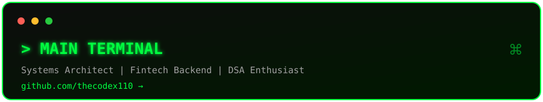
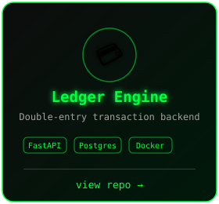
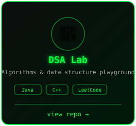
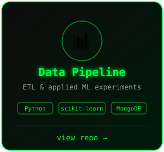
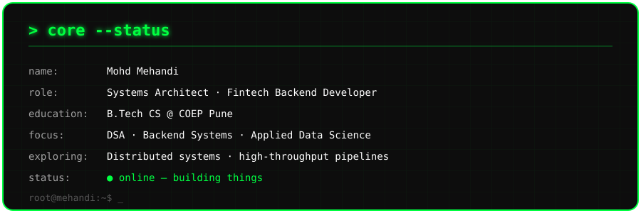
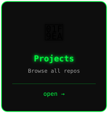
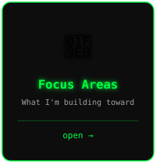
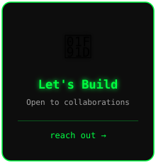

  

<h3 align="center">
    <samp>
        &gt; Hey there, I am
        <b><a target="_blank" href="https://www.linkedin.com/in/mohd-mehandi-bb5204375">Mohd Mehandi</a></b>
    </samp>
</h3>

 

<samp>
「 Systems Architect building fintech backend systems, data pipelines, and DSA-driven solutions 」
</samp>

  

  

&nbsp;

&nbsp;

  

⚠️ Placeholder repo links above — swap them for your real repos, and edit the matching <code>.svg</code> in <code>docs/img/system/</code> if the project name/stack changes.

  

# 🛠 Technologies, Projects, and Domains

<table border="0" cellspacing="10" cellpadding="0">
<tr>

<!-- LEFT: TOOLS -->
<td width="420" valign="top" align="center">

<h3>🛠 Technologies</h3>
 

<table align="center" cellspacing="0" cellpadding="6">
  <tr>
    <td align="center"></td>
    <td align="center"></td>
    <td align="center"></td>
    <td align="center"></td>
    <td align="center"></td>
  </tr>
  <tr>
    <td align="center"></td>
    <td align="center"></td>
    <td align="center"></td>
    <td align="center"></td>
    <td align="center"></td>
  </tr>
  <tr>
    <td align="center"></td>
    <td align="center"></td>
    <td align="center"></td>
    <td align="center"></td>
    <td align="center"></td>
  </tr>
  <tr>
    <td align="center"></td>
    <td align="center"></td>
    <td align="center"></td>
    <td align="center"></td>
    <td align="center"></td>
  </tr>
  <tr>
    <td align="center"></td>
    <td colspan="4"></td>
  </tr>
</table>

</td>

<!-- PROJECTS -->
<td width="260" valign="top" align="center">

<h3>🧪 Projects</h3>
 

  

</td>

<!-- FOCUS AREAS -->
<td width="260" valign="top" align="center">

<h3>🧠 Focus Areas</h3>
 

    

</td>

</tr>
</table>

### 📊 Vital Statistics

  

  

  

<table width="100%" border="0" cellspacing="10" cellpadding="0">
<tr>

<!-- LEFT: COLLAB -->
<td width="33%" valign="top">

<h2>🤝 Collaboration</h2>

I'm open to collaborating on:

<ul>
  <li>Fintech backend systems</li>
  <li>High-throughput transaction pipelines</li>
  <li>Applied data science / ML projects</li>
  <li>DSA-heavy backend optimization</li>
</ul>

</td>

<!-- MIDDLE: PANEL -->
<td width="34%" align="center" valign="middle">
    
</td>

<!-- RIGHT: CONTACT -->
<td width="33%" valign="top" align="center">

<h2>📫 Contact</h2>

 

  

  

</td>

</tr>
</table>

⚡ Building fintech backend systems, one commit at a time

Star ⭐ the repos if they helped you!

  <a href="./CODE_OF_CONDUCT.md">Code of Conduct</a> ·
  <a href="./CONTRIBUTING.md">Collaboration</a> ·
  <a href="./SECURITY.md">Security</a>

    

  

